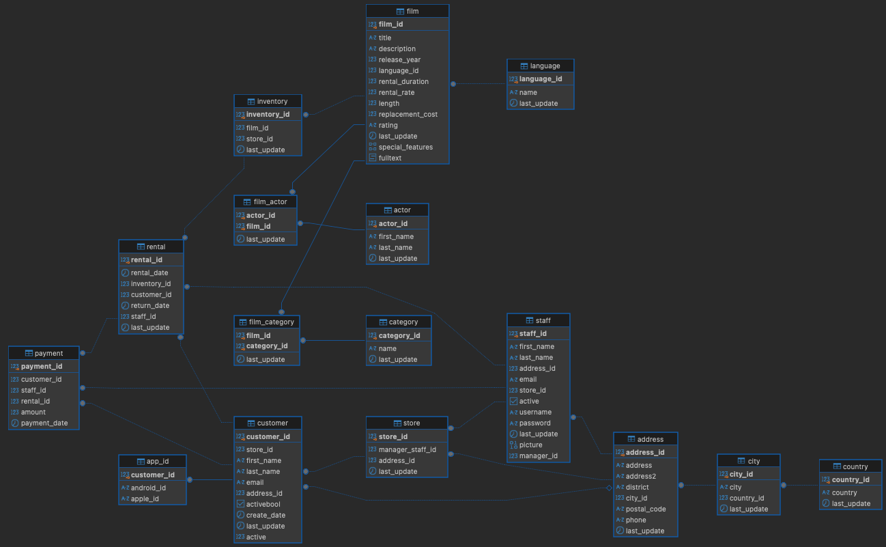

# Extract and Transform Team Challenge

Our customer, BluckBoster Entertainment, has asked us to help them.  They are data ignorant!  They have collected a myriad of data about their customers, the products they rent out, stores and employees.  The issue is, they have no idea what it may tell them!  They have asked us to help them understand their data better and perform a full company review to uncover any insights that may be hidden in the data.

We have been asked by our Data Science team to do some extraction and transformation of the data.  We have access to a relational database with a number of tables of data.  However, they have been unclear as to what they mean by this, so you will need to do some Exploratory Data Analysis (EDA) to understand the data and what it may tell them.

---

## Database Access

You will use the following connection details to access the database:

```txt
host: data-sandbox.c1tykfvfhpit.eu-west-2.rds.amazonaws.com
port: 5432
database: pagila
schema: main
```

Your username and password can be found in your Noodle profile.

---

## Data

The following is the Entity Relationship Diagram (ERD) for the database:



---

## Tasks

1. Connect to the database and explore the data
2. Decide on some initial questions you think the data may be able to answer
3. Extract the data from the database
4. Transform the data into a format that can be used for analysis, including cleaning it
5. Perform some initial analysis to understand the data better
6. Create a report on your findings - you should aim for a 5-10 minute presentation with good visualisations to help tell the story

---

## Baseline Criteria

You should aim to utilise the following tools and techniques:

- SQL
- Python
- Pandas
- Matplotlib or Seaborn
- Jupyter Notebooks
- Markdown
- Git/GitHub
- Data extraction
- Data transformation
- Data cleaning
- Data visualisation
- Presentation skills

---

## Presentation

You should aim to present your findings in a 5-10 minute presentation.  You should aim to include the following:

- An introduction to the data and the problem
- A summary of the data extraction and transformation process
- A summary of the analysis you have performed
- Any insights you have uncovered

---

## Submission

You should submit, as a group and via the Noodle submission link, the following:

1. A link to your team's GitHub repository that includes:
   - A Jupyter Notebook with your analysis
   - Your presentation slides
   - Any other relevant files

---

---
