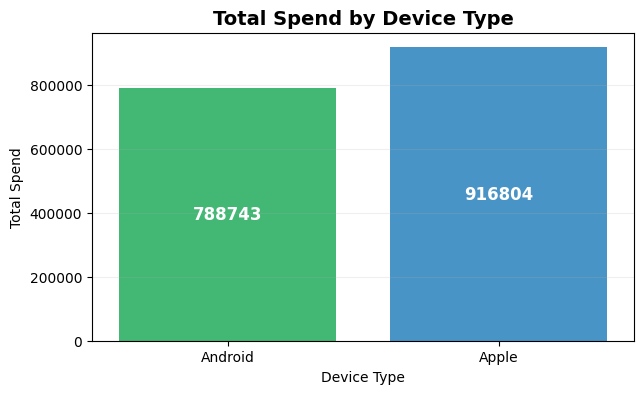
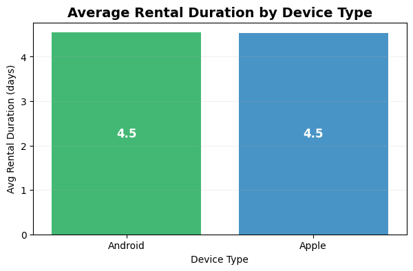
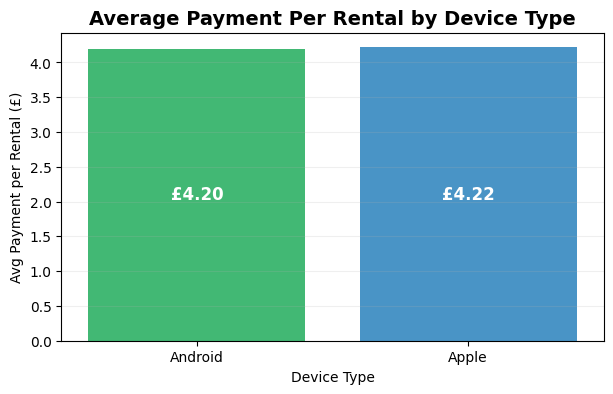
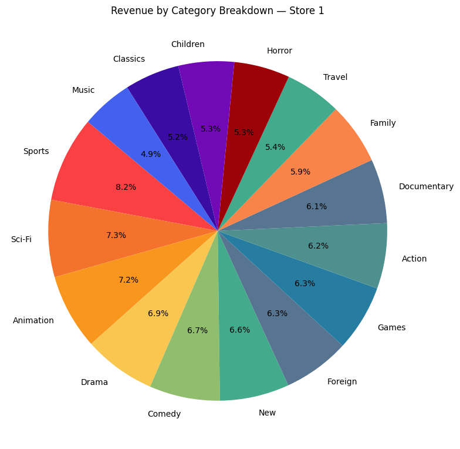

# Buster Block Team 1 Presentation

---

## 1. Monthly Revenue by Rating & Seasonal Rental Patterns

Analyze revenue trends across different months to identify patterns in business performance over time.

The business showed strong growth momentum from February through April 2007. April 2007 represents the peak performance with nearly $28,600 in revenue.

 

Determine which film rating categories (G, PG, PG-13, R, NC-17) generate the most revenue for the business.

PG-13 films are the top revenue generators, outperforming other categories by approximately $1,200–$3,300. Revenue distribution is relatively balanced across all ratings, with only a 24% difference between highest (PG-13) and lowest (G). Surprisingly, family-friendly G-rated content generates the least revenue despite typically having broader audience appeal.

 

Identify seasonal trends in customer rental behavior to understand demand fluctuations throughout the year.

Summer completely dominates rental activity with over 92% of all transactions occurring in this season. Fall shows essentially zero activity, confirming the dataset doesn't extend into September–November.

---

## 2. Average Rental Days & Payment by Device Type

- No customers with no device ID — either Apple or Android
- No null or non-numeric amounts in payments or negative payments
- No missing rental dates
- 183 missing return dates  
  - Book still borrowed or not returned?
- 846 zero-day returns (same-day returns)  
  - Dropped for analysis to not skew the data

 

- Apple users spent around £916k  
- Android users spent around £788k  
- Overall, Apple users generated more revenue, even though the number of users might be similar

 

- Both groups had an almost identical rental duration:  
  - 4.5 days on average for Android  
  - 4.5 days on average for Apple  
- This suggests device type does not affect how long customers keep a rental

 

- The payment per rental was extremely close:  
  - Android: £4.20  
  - Apple: £4.22  
- Despite spending more overall, Apple users don't pay more per rental  
  - This means they likely rent more frequently, not at higher prices

 

**Conclusion:**  
Device type does not meaningfully impact rental duration or the price customers pay per rental.  
The only major difference is total spend — Apple users contribute more revenue, likely due to higher rental volume.

---

## 3. Revenue, Customers and Category by Store

### Revenue and Customer Count

These graphs show that Canada outperforms the Australia store in both revenue and unique customers.

 

### Category Revenue Breakdown

These graphs show that both stores have very similar, balanced distributions of revenue across film categories. There are slight differences within these, with Canada (left) earning slightly more from Sports, Sci‑Fi, and Animation, while Australia (right) performs better in Family, Action, Horror, and Classics.

---

## 4. Revenue by Country

 

It can be seen that the top 10 countries by amount purchased are the same as the top 10 countries by number of customers.

---

## 5. Category Popularity by Country

The graph shows worldwide data of how often a film of a given category is rented, showing which categories are more popular overall — with Sports films leading, and Music being the least popular.

 

This graph shows how many countries have each category as their number one. While Sports dominates in total rentals, Animation appears as the top category in more countries — highlighting that smaller countries may skew results.

 

These two graphs show the top and bottom 10 countries by total number of rentals. India has the most, and Tonga the least, with a 1,554-rental gap. A single rental in Tonga has far greater weight in relative importance compared to one in India — which helps explain why Animation, not Sports, tops the most countries despite not being the most-rented overall.

---

# Interesting Finds

- All films in the dataset are listed as released in 2006, but almost 99% of rentals occurred in 2005. This points to a **data inconsistency**.
- The "Runion" entry in the countries table may refer to **Réunion Island**, which is a French overseas territory — not a sovereign country.
