# Buster Block Team 1 Presentation

1) Monthly revenue/by rating and seasonal rental patterns

{width=50%}

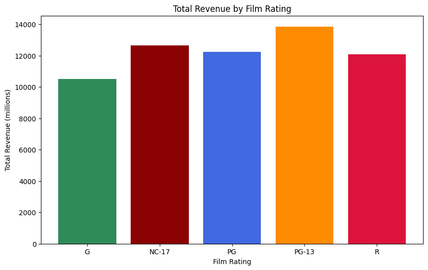

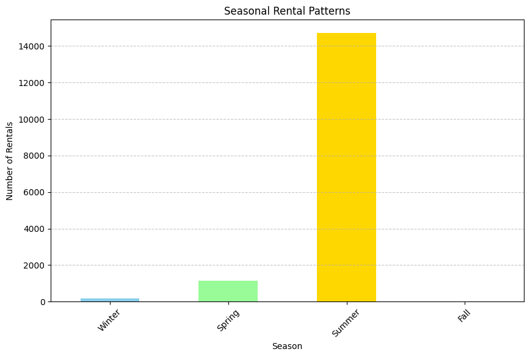
1) Device/ average rental days by device and average payment per rental device.

2) By store  

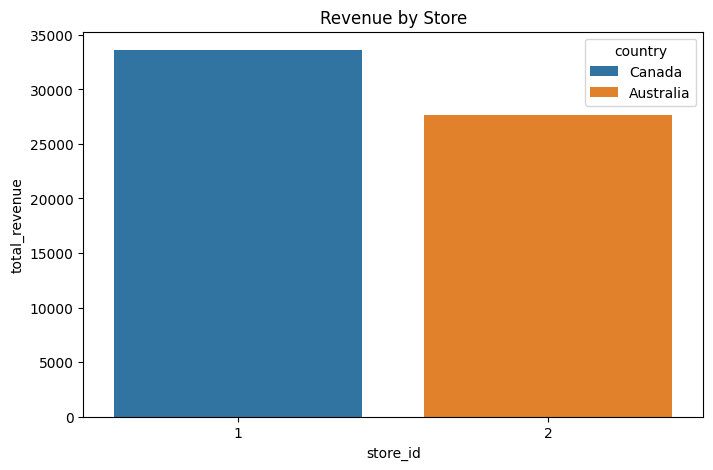

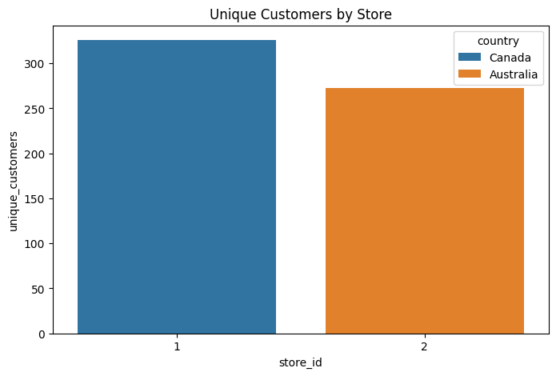

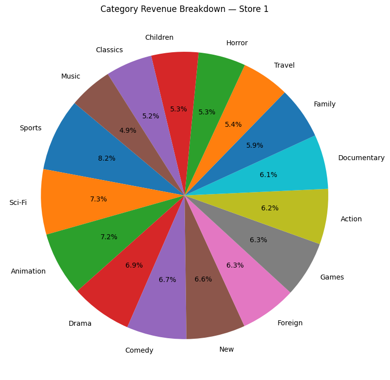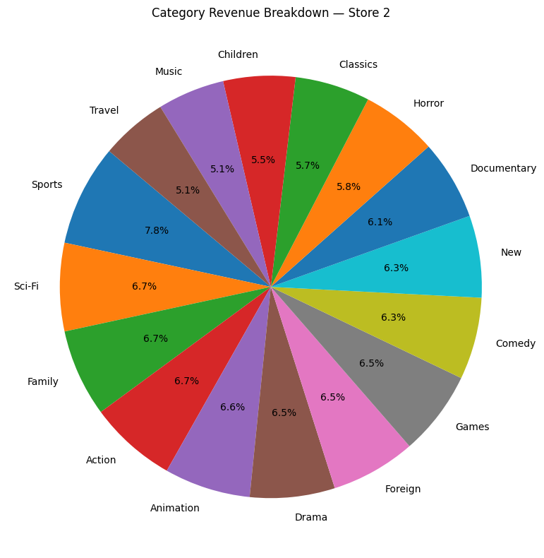

1) By country

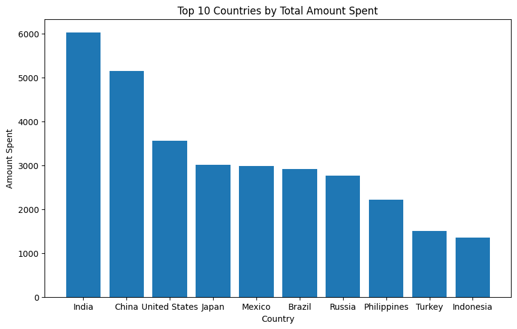

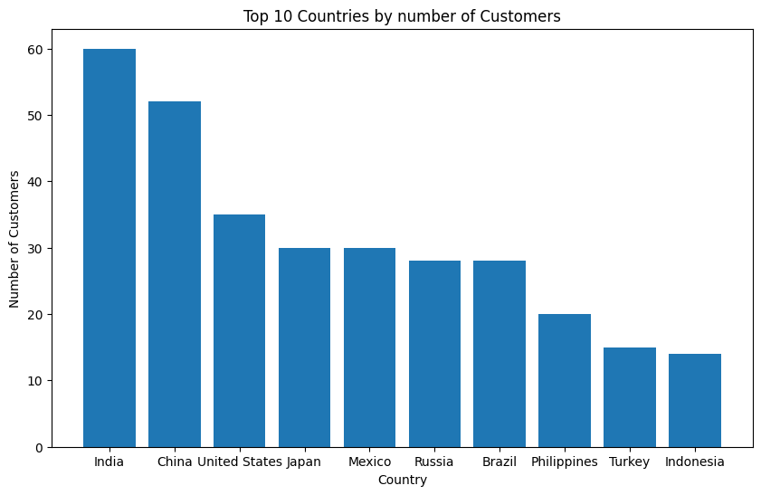

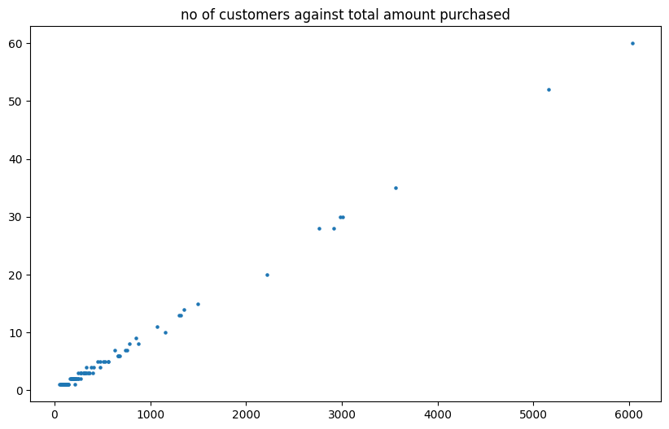
4) Category popularity by country

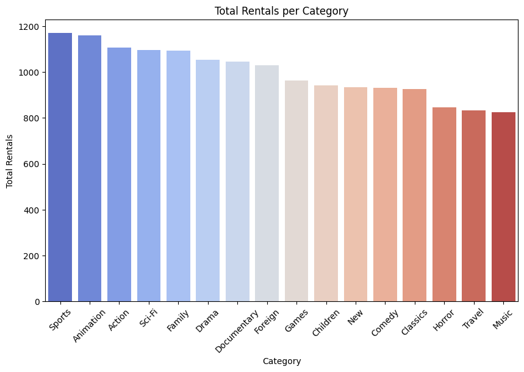

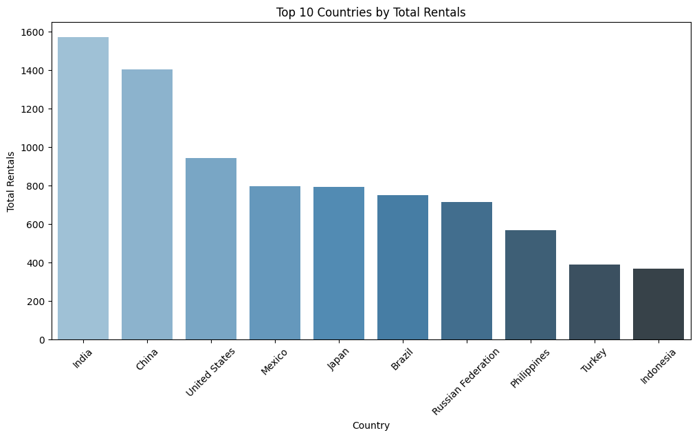

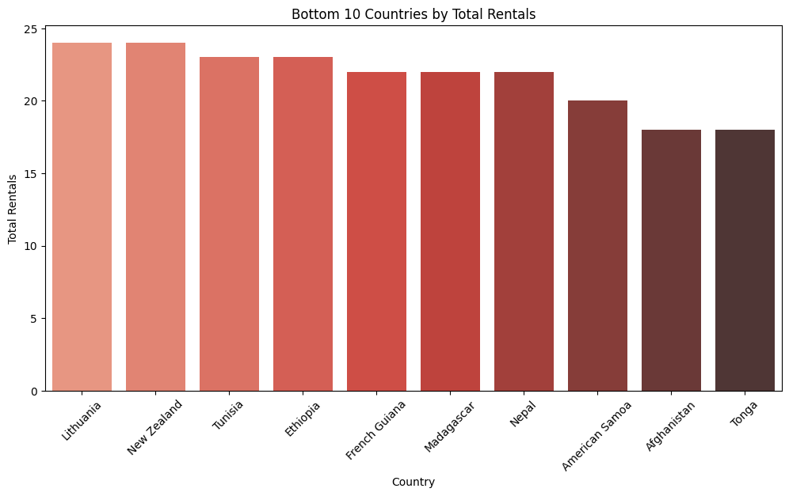

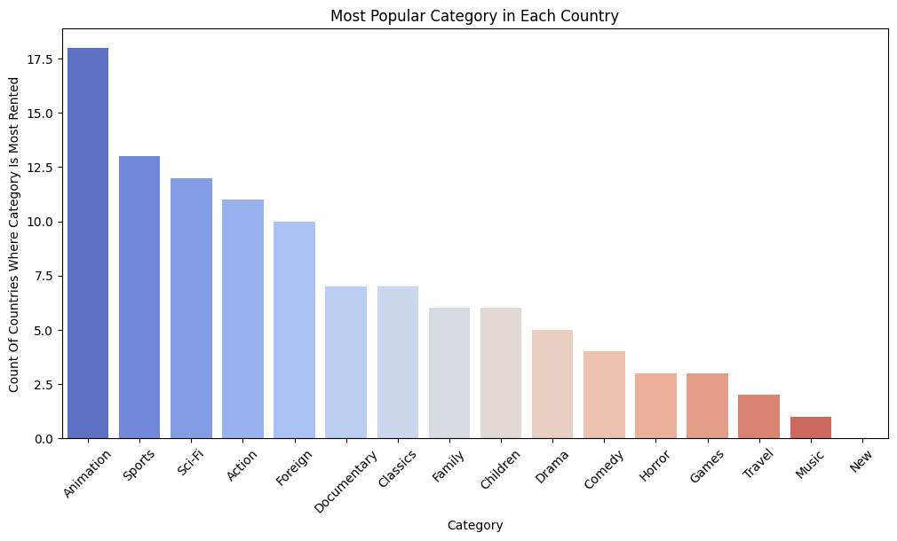